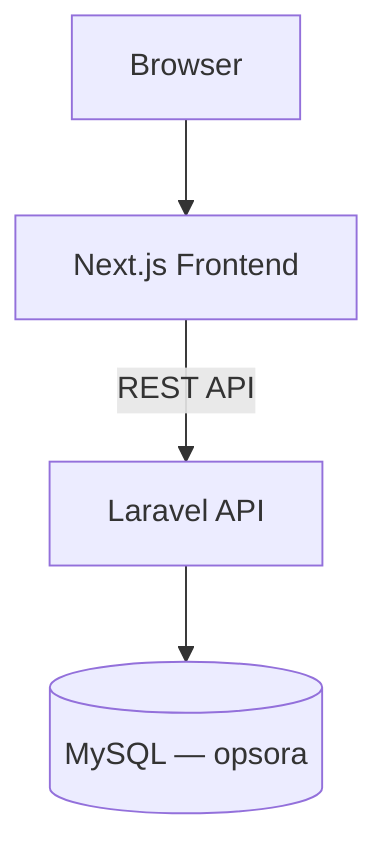
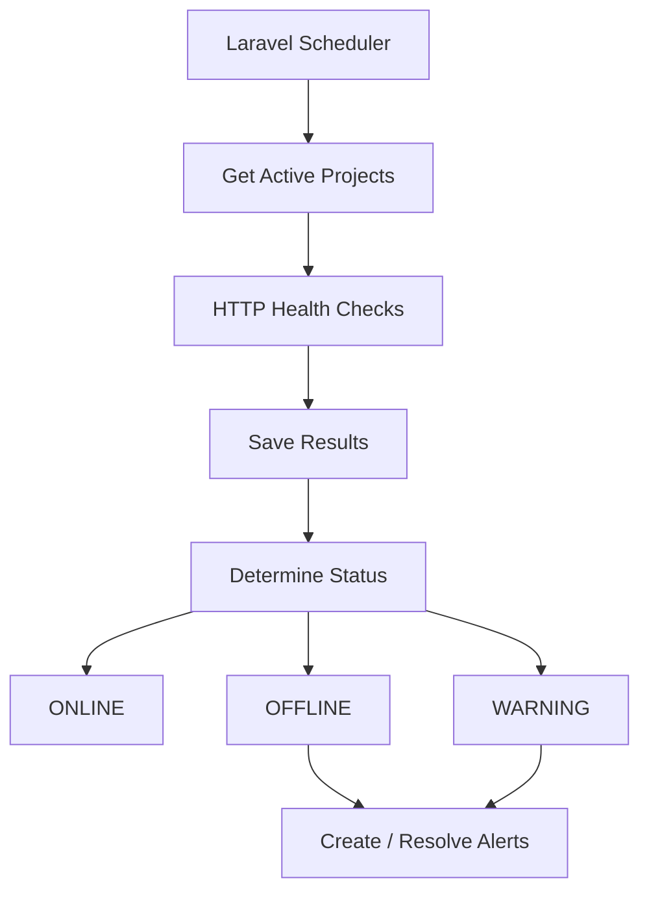
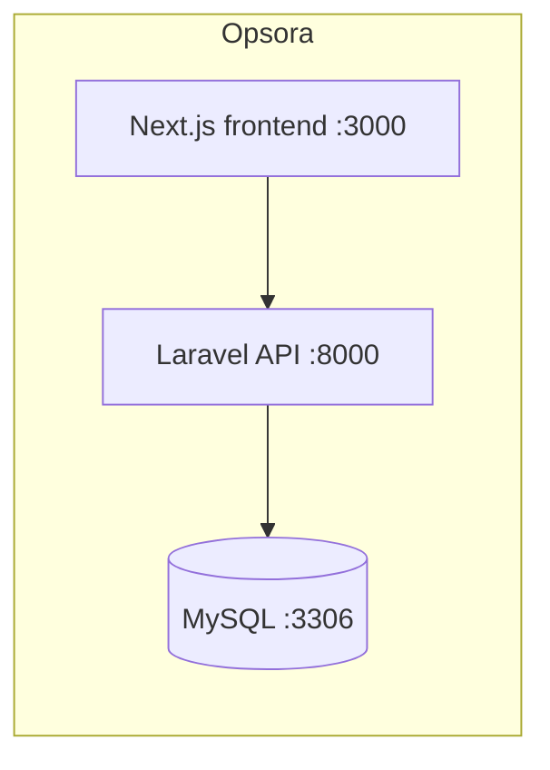

# ⚡ Opsora

Infrastructure & Application Monitoring Platform

**Monitor. Detect. Respond.**

Opsora is a self-hosted internal monitoring platform that gives an administrator one dashboard to answer: *are my applications healthy, which one is having a problem, how fast are they responding, and what's currently on fire?*

> **Status:** MVP under active development. Phases 1 (Foundation), 2 (Authentication), 3 (Projects), and 4 (Monitoring) are implemented. See [Roadmap](#roadmap) for what's next.

---

## Table of contents

1. [Product overview](#product-overview)
2. [Features](#features)
3. [Architecture](#architecture)
4. [Technology stack](#technology-stack)
5. [Requirements](#requirements)
6. [Local installation](#local-installation)
7. [Docker installation](#docker-installation)
8. [Environment setup](#environment-setup)
9. [Database setup](#database-setup)
10. [Seeder](#seeder)
11. [Scheduler](#scheduler)
12. [API documentation](#api-documentation)
13. [Production deployment](#production-deployment)
14. [Security considerations](#security-considerations)
15. [Troubleshooting](#troubleshooting)
16. [Roadmap](#roadmap)

---

## Product overview

Opsora centralizes monitoring for deployed web applications, servers, and Docker containers behind a single dark, technical, professional dashboard. An administrator can:

- See which applications are online, warning, or offline
- Track response time and uptime per project
- Register servers and view basic CPU/memory/disk metrics
- View and restart Docker containers (backend-mediated, never exposed to the browser)
- Get deduplicated alerts when something goes wrong, and see them resolve on recovery
- Review an activity log of who did what

The MVP deliberately runs on the smallest infrastructure that can do this reliably: **Next.js + Laravel + MySQL + Docker + Laravel Scheduler.** No Redis, no queue workers, no Kubernetes.

## Features

Implemented so far:

- [x] Admin login / logout (Laravel Sanctum, session-based SPA auth)
- [x] Rate-limited login with lockout on repeated failures
- [x] Protected routes (frontend guard + backend `auth:sanctum`)
- [x] Dashboard shell with stat cards and dark Opsora branding
- [x] Docker Compose for `frontend` + `backend` + `mysql`
- [x] Projects CRUD (add / edit / delete / enable-disable monitoring)
- [x] Project details page and dashboard project table with live status
- [x] HTTP health checks (` opsora:health-check `, every-minute scheduler) with ONLINE/WARNING/OFFLINE detection
- [x] 24-hour response-time history chart and uptime calculation per project
- [x] Dashboard stats (online/warning/offline counts, average response time) backed by real data

Planned (see [Roadmap](#roadmap)): alerts with deduplication, server metrics, container management, activity logs.

## Architecture



Monitoring loop (planned, Phase 4):



### Docker topology



Nginx is intentionally left out until production routing actually requires it.

## Technology stack

| Layer | Choice |
|---|---|
| Frontend | Next.js (App Router), TypeScript, Tailwind CSS, shadcn/ui, Recharts, Axios |
| Backend | Laravel 12, PHP 8.3+, Laravel Sanctum, Laravel Scheduler |
| Database | MySQL 8 |
| Infra | Docker, Docker Compose |

Explicitly **not** used in the MVP: Redis, PostgreSQL, RabbitMQ, Kafka, Prometheus, Grafana, Kubernetes, Docker Swarm, queue workers.

## Requirements

- Node.js 20+ and npm
- PHP 8.3+ and Composer
- MySQL 8 (local install, or via Docker)
- Docker + Docker Compose (for the containerized setup)

## Local installation

Clone the repo, then set up each app.

### Backend

```bash
cd backend
composer install
cp .env.example .env
php artisan key:generate
```

Edit `.env` — set your MySQL credentials and the initial admin credentials (see [Environment setup](#environment-setup)) — then:

```bash
php artisan migrate
php artisan db:seed
php artisan serve --port=8000
```

### Frontend

```bash
cd frontend
npm install
cp .env.local.example .env.local   # set NEXT_PUBLIC_API_URL if it isn't :8000
npm run dev
```

Visit `http://localhost:3000` — it redirects to `/login`.

## Docker installation

From the repo root:

```bash
cp .env.example .env
# edit .env: set APP_KEY, DB_PASSWORD, DB_ROOT_PASSWORD, ADMIN_PASSWORD
docker compose up -d --build
```

This starts `frontend` (port 3000), `backend` (port 8000), and `mysql` (port 3306). The backend container runs migrations and starts the scheduler automatically on boot (see [`backend/docker/entrypoint.sh`](backend/docker/entrypoint.sh)).

Generate an `APP_KEY` beforehand with:

```bash
php artisan key:generate --show
```

## Environment setup

Two `.env` files matter:

- **Root `.env`** (from `.env.example`) — only used by `docker compose`, to inject values into the containers.
- **`backend/.env`** (from `backend/.env.example`) — used when running Laravel directly (not in Docker).

Key variables:

```env
APP_NAME=Opsora
DB_CONNECTION=mysql
DB_HOST=mysql        # or 127.0.0.1 for local (non-Docker) MySQL
DB_PORT=3306
DB_DATABASE=opsora
DB_USERNAME=
DB_PASSWORD=

FRONTEND_URL=http://localhost:3000
SANCTUM_STATEFUL_DOMAINS=localhost:3000,127.0.0.1:3000
SESSION_DOMAIN=localhost

# Initial administrator (used by the seeder — never hard-code this)
ADMIN_NAME=Admin
ADMIN_EMAIL=admin@example.com
ADMIN_PASSWORD=
```

Never commit a real `.env` file — both are already git-ignored.

## Database setup

```bash
cd backend
php artisan migrate
```

Database name is `opsora`. Tables so far: `users`, `personal_access_tokens`, `cache`, `jobs` (Laravel defaults), `projects`, `health_checks` — `servers`, `alerts`, and `activity_logs` land in later phases per the schema in the product spec. `projects.server_id` is a plain nullable column for now; its foreign key constraint is added once the `servers` table exists (Phase 6).

## Seeder

```bash
php artisan db:seed
```

Creates (or updates) the initial administrator from `ADMIN_NAME` / `ADMIN_EMAIL` / `ADMIN_PASSWORD`. If `ADMIN_PASSWORD` is left blank, the seeder generates a random one and prints it to the console — set it explicitly for anything beyond a throwaway local run.

## Scheduler

Runs `opsora:health-check` every minute against all active projects (see `routes/console.php`):

```bash
# Development
php artisan schedule:work

# Run a single check manually
php artisan opsora:health-check

# Docker: already runs inside the backend container's entrypoint
```

No Redis, no queue worker — the scheduler alone drives the every-minute health check loop.

## API documentation

Base URL: `/api`. All authenticated routes use Sanctum session cookies (SPA auth) — the frontend fetches `GET /sanctum/csrf-cookie` before any state-changing request.

| Method | Route | Auth | Description |
|---|---|---|---|
| GET | `/sanctum/csrf-cookie` | — | Issues the CSRF cookie required before login |
| POST | `/api/login` | — (rate-limited) | Authenticate, returns the current user |
| POST | `/api/logout` | Sanctum | Invalidate the session |
| GET | `/api/user` | Sanctum | Current authenticated user |
| GET | `/api/projects` | Sanctum | List all projects |
| POST | `/api/projects` | Sanctum | Create a project |
| GET | `/api/projects/{id}` | Sanctum | Show a project |
| PUT | `/api/projects/{id}` | Sanctum | Update a project |
| DELETE | `/api/projects/{id}` | Sanctum | Delete a project |
| GET | `/api/dashboard` | Sanctum | Aggregate stats + projects with latest health |
| GET | `/api/projects/{id}/health` | Sanctum | Latest status, uptime, avg response time |
| GET | `/api/projects/{id}/health-history` | Sanctum | Last 24h of health checks |

Remaining endpoints (`/api/servers`, `/api/containers`, `/api/alerts`, `/api/activity`) are specified in the product spec and land with their respective phases.

## Production deployment

1. Build and start via Docker Compose (see [Docker installation](#docker-installation)), pointing `APP_URL` / `FRONTEND_URL` at your real domains.
2. Set `APP_ENV=production`, `APP_DEBUG=false`.
3. Put real, unique values in `DB_PASSWORD`, `DB_ROOT_PASSWORD`, and `ADMIN_PASSWORD` — never reuse the local dev values.
4. Introduce Nginx only if you need TLS termination or routing beyond what the containers already expose — it isn't part of the MVP by default.
5. Run `php artisan migrate --force` and `php artisan db:seed --force` once against the production database.

## Security considerations

- Laravel Sanctum session-cookie auth with CSRF protection; no public registration — the only account is the seeded administrator.
- Login is rate-limited (5 attempts per email+IP with a lockout window, plus a route-level throttle).
- CORS is restricted to `FRONTEND_URL`, not `*`, with `supports_credentials` enabled.
- Docker Engine is never exposed to the browser — planned container actions (Phase 7) go through the Laravel backend only.
- Server credentials (SSH keys/passwords, API secrets) are intentionally kept out of the `servers` table by design.
- Secrets live only in `.env` files, which are git-ignored; `.env.example` files ship with blank secrets.

## Troubleshooting

**`Failed to listen on 127.0.0.1:8000`** — something else (often another local service) already owns port 8000. Run `php artisan serve --port=8001` and update `NEXT_PUBLIC_API_URL` / CORS accordingly.

**`CSRF token mismatch` (419) when calling the API directly (e.g. via curl)** — the frontend calls `GET /sanctum/csrf-cookie` first and sends the resulting `XSRF-TOKEN` back as an `X-XSRF-TOKEN` header; a browser does this automatically. Also make sure the request's `Referer`/`Origin` matches `SANCTUM_STATEFUL_DOMAINS`, and that you're hitting the same hostname the cookie's `Domain` was set for (e.g. don't mix `localhost` and `127.0.0.1`).

**`Unauthenticated` (401) right after logging in** — same as above: stateful auth is Referer/Origin-aware, so requests without those headers fall through to token auth (which isn't configured) instead of the session guard.

**Migrations fail to connect to MySQL** — confirm `DB_HOST`/`DB_PORT`/`DB_DATABASE`/`DB_USERNAME`/`DB_PASSWORD` in `backend/.env`, and that the `opsora` database exists (`CREATE DATABASE opsora;`).

## Roadmap

Building in this order (see the product spec for full phase breakdowns):

- [x] **Phase 3 — Projects:** CRUD, monitoring table, project details page
- [x] **Phase 4 — Monitoring:** `opsora:health-check`, scheduler, uptime, 24h chart
- **Phase 5 — Alerts (next up):** creation, deduplication, resolution
- **Phase 6 — Servers:** CRUD, metrics service
- **Phase 7 — Containers:** listing, status, authenticated restart
- **Phase 8 — Activity:** logging, activity page
- **Phase 9 — Polish:** loading/error/empty states, responsive pass, security review

Post-MVP (v1.1+): email/Discord/Telegram notifications, SSL/domain monitoring, GitHub integration, CI/CD, and — much later — Redis, queue workers, Prometheus/Grafana, multi-server monitoring, and RBAC.